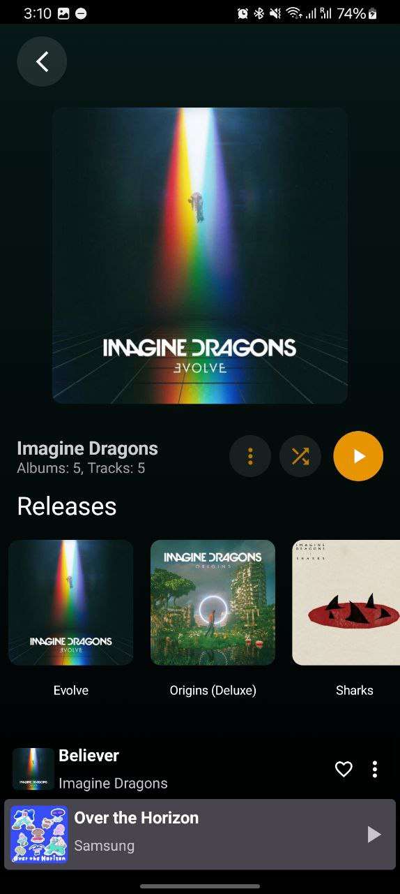

# Music Player

  
   

MStreamPlayer is an Android application created for playing music with Jetpack Compose framework and ExoPlayer.

## Result

### Screens
|      |          |      |        |         |
|----------------------------------------------|:------------------------------------------:|:---------------------------------------:|:------------------------------------------:|:--------------------------------------------:|
|  |  |  |  |   |

## Tech stack & Open-source libraries

- [Kotlin](https://kotlinlang.org/) based
- [ExoPlayer](https://github.com/google/ExoPlayer) for playing multimedia files
- [Coroutines](https://kotlinlang.org/docs/reference/coroutines-overview.html) for asynchronous.
- [JetPack](https://developer.android.com/jetpack)
  - [Compose](https://developer.android.com/jetpack/compose) - Modern toolkit for building native UI.
  - [Lifecycle](https://developer.android.com/topic/libraries/architecture/lifecycle) - Create a UI that automatically responds to lifecycle events.
  - [LiveData](https://developer.android.com/topic/libraries/architecture/livedata) - Notify domain layer data to views.
  - [Navigation](https://developer.android.com/jetpack/compose/navigation) - Handle everything needed for in-app navigation.
  - [ViewModel](https://developer.android.com/topic/libraries/architecture/viewmodel) - UI related data holder, lifecycle aware.
  - [Room](https://developer.android.com/jetpack/androidx/releases/room) = Database
- [Hilt](https://dagger.dev/hilt/) - For [dependency injection](https://developer.android.com/training/dependency-injection/hilt-android).
- [Coil](https://github.com/coil-kt/coil) - An image loading library for Android backed by Kotlin Coroutines.
- [Pallete API](https://developer.android.com/training/material/palette-colors)
- [Firebase](https://firebase.google.com/) - FireStore Database and Storage
- [Retrofit](https://square.github.io/retrofit/) - HTTP API

## Features

- Jetpack Compose UI. Custom animations, transitions, light/dark theme and layouts.
- Jetpack Compose Navigation
- Clean Architecture, MVI
- Dependency injection with Hilt
- Retrieves songs metadata from the device and network specifically from firebase
- Allows background playback using a foreground service
- Media style notifications
- Uses a MediaBrowserService to control and expose the current media session
- Controls the current playback state with actions such as: play/pause, swipe bottom bar to skip next/previous, skip to next/previous, shuffle, repeat and stop
- Supports Sorting media by album and artist
- Room Database for storing media metadata
- Playlist creation and edit support
- Change of color pallet and theme of app via settings (preferencesDataStore)
- Radio playback from radio-browser.info (Retrofit)
- Search through media

